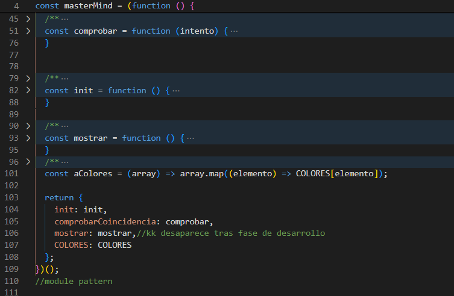
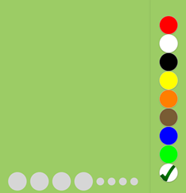
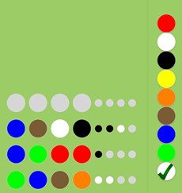
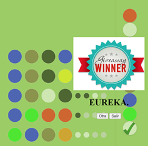
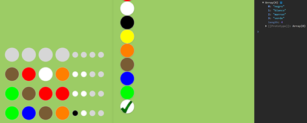
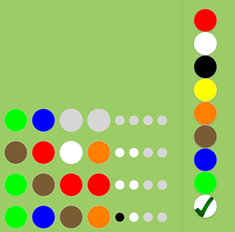
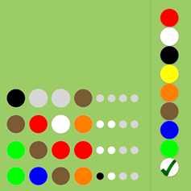

# Mastermind

## El juego
Aprende a jugar al Mastermind para implementarlo mediante JavaScript.

[Mastermind online](https://www.zagrajsam.pl/en/dzialy_gier.php?gra=3)

El objetivo del juego es adivinar 4 canicas escondidas. La tarea se completa en varios intentos y se gana cuando el jugador adivina esas canicas. En cada turno (en nuestro caso sin límite), el jugador elige 4 canicas y luego comprueba si se ha acertado. 
- Cada canica posicionada correctamente (la canica del color correcto y en el lugar correcto) está señalizada con un punto negro.
- Si el jugador adivinó el color de la canica pero no adivinó su ubicación, se indica con un punto blanco.

El jugador no sabe qué canicas son correctas y cuáles no. Hay que tener en cuenta que los colores pueden repetirse. En nuestro caso el juego está disponible  con 4 columnas.

## La implementación

Vamos a separar la capa de negocio de la capa de presentación, por lo que primero vamos a crear un objeto `masterMind` mediante closures. Con él podrás jugar desde la consola. Una vez implementado y probado, añade el entorno gráfico.

### Capa de negocio. Objeto `masterMind` con closures

Utilizando closures, créate un objeto masterMind al que puedas invocar los siguientes métodos:
- `masterMind.init()`: genera una combinación objetivo. Será la que el jugador debe adivinar.
- `masterMind.mostrar()`: muestra la combinación objetivo por consola. Nos facilitará a la hora de hacer pruebas. Ejecutadlo en cada partida para facilitar la corrección.
- `masterMind.comprobarCoincidencia(intento)`: genera una combinación de negros (número de bolas que están en su sitio) y blancos (número de bolas que están, pero no en su sitio).

Con este objeto jugarás DESDE LA CONSOLA
Usa el module pattern para publicar sólo los tres métodos indicados y el IIFE para crear el closure.

### Capa de presentación. Entorno gráfico

Ahora genera el entorno gráfico:
- Habrá ocho colores distintos
- Cada combinación constará de 4 bolas
- Los colores pueden repetirse
- Cuando se llegue al acierto (4 bolas negras) se le dará opción de comenzar de nuevo (otra combinación objetivo nueva) o salir (despedida)
- Los colores (verticales) se colocan en cada clic, de izquierda a derecha si hay huecos
- En los intentos (colores en horizontal) los colores desaparecen en cada clic si está colocado.
- La comprobación se realiza mediante un botón

Qué debes utilizar:
- atributos data-* para localizar el elemento libre
- array.find() para localizar el primer elemento libre a colorear
- arrow function para localizar el primer elemento libre
- elemento.classList para añadir/eliminar una clase

### En imágenes

A continuación se muestra el juego en imágenes.

#### Inicio y juego...

#### Cuando hay un ganador...

#### Una pista en consola...

#### Poniendo y quitando colores...

## De interés
[How the Module Pattern Works in JavaScript](https://www.telerik.com/blogs/how-module-pattern-works-javascript#:~:text=The%20module%20pattern%20keeps%20the,object%20instead%20of%20a%20function.)
[Mastermind Gameplay](https://youtu.be/of6qysmfELQ)

